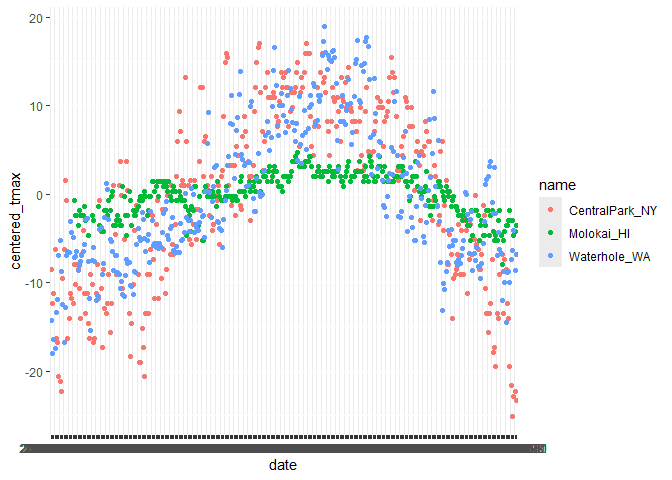

DS_NOTES_EDA
================

``` r
library(tidyverse)
library(dplyr)
library(ggridges)
library(patchwork)
```

``` r
  weather_df = read.csv("C:/Users/Twilight/Desktop/Columbia/Fall Semester 2024/Data Science I/Datasets/weather_data.csv")
  weather_df <- weather_df %>% mutate(month = format(as.Date(date), "%m")) # creates a new column month extracted from date column
```

### Exploratory Data Analysis

- Exploratory Data Analysis is a loosely-defined process. Roughly, the
  stuff between loading data and formal analysis is exploratory.
- Grouping
  - Datasets often consists of groups(by design/implied/nested)
- Quantitative comparisons across groups are informative
  - Measures of Centrality, Variablity, Missingnes
- `group_by()` + `summarize()`
  - `group_by` makes grouping explicit and adds a layer to your data
  - `summarize()` allows you to compute one-number summaries
    - most useful in conjunction with `group_by()`

#### `group_by()`

``` r
  weather_df %>%
    group_by(name, month)
```

    ## # A tibble: 1,095 × 8
    ## # Groups:   name, month [36]
    ##        X name           id          date        prcp  tmax  tmin month
    ##    <int> <chr>          <chr>       <chr>      <int> <dbl> <dbl> <chr>
    ##  1     1 CentralPark_NY USW00094728 2017-01-01     0   8.9   4.4 01   
    ##  2     2 CentralPark_NY USW00094728 2017-01-02    53   5     2.8 01   
    ##  3     3 CentralPark_NY USW00094728 2017-01-03   147   6.1   3.9 01   
    ##  4     4 CentralPark_NY USW00094728 2017-01-04     0  11.1   1.1 01   
    ##  5     5 CentralPark_NY USW00094728 2017-01-05     0   1.1  -2.7 01   
    ##  6     6 CentralPark_NY USW00094728 2017-01-06    13   0.6  -3.8 01   
    ##  7     7 CentralPark_NY USW00094728 2017-01-07    81  -3.2  -6.6 01   
    ##  8     8 CentralPark_NY USW00094728 2017-01-08     0  -3.8  -8.8 01   
    ##  9     9 CentralPark_NY USW00094728 2017-01-09     0  -4.9  -9.9 01   
    ## 10    10 CentralPark_NY USW00094728 2017-01-10     0   7.8  -6   01   
    ## # ℹ 1,085 more rows

### counting things

``` r
  weather_df %>%
    group_by(month) %>%
    summarize(n_obs=n())
```

    ## # A tibble: 12 × 2
    ##    month n_obs
    ##    <chr> <int>
    ##  1 01       93
    ##  2 02       84
    ##  3 03       93
    ##  4 04       90
    ##  5 05       93
    ##  6 06       90
    ##  7 07       93
    ##  8 08       93
    ##  9 09       90
    ## 10 10       93
    ## 11 11       90
    ## 12 12       93

``` r
  weather_df %>%
    group_by(name, month) %>%
    summarize(count=n())
```

    ## `summarise()` has grouped output by 'name'. You can override using the
    ## `.groups` argument.

    ## # A tibble: 36 × 3
    ## # Groups:   name [3]
    ##    name           month count
    ##    <chr>          <chr> <int>
    ##  1 CentralPark_NY 01       31
    ##  2 CentralPark_NY 02       28
    ##  3 CentralPark_NY 03       31
    ##  4 CentralPark_NY 04       30
    ##  5 CentralPark_NY 05       31
    ##  6 CentralPark_NY 06       30
    ##  7 CentralPark_NY 07       31
    ##  8 CentralPark_NY 08       31
    ##  9 CentralPark_NY 09       30
    ## 10 CentralPark_NY 10       31
    ## # ℹ 26 more rows

``` r
  # Using "count"
  weather_df %>%
    count(name, month, name="n_obs")
```

    ##              name month n_obs
    ## 1  CentralPark_NY    01    31
    ## 2  CentralPark_NY    02    28
    ## 3  CentralPark_NY    03    31
    ## 4  CentralPark_NY    04    30
    ## 5  CentralPark_NY    05    31
    ## 6  CentralPark_NY    06    30
    ## 7  CentralPark_NY    07    31
    ## 8  CentralPark_NY    08    31
    ## 9  CentralPark_NY    09    30
    ## 10 CentralPark_NY    10    31
    ## 11 CentralPark_NY    11    30
    ## 12 CentralPark_NY    12    31
    ## 13     Molokai_HI    01    31
    ## 14     Molokai_HI    02    28
    ## 15     Molokai_HI    03    31
    ## 16     Molokai_HI    04    30
    ## 17     Molokai_HI    05    31
    ## 18     Molokai_HI    06    30
    ## 19     Molokai_HI    07    31
    ## 20     Molokai_HI    08    31
    ## 21     Molokai_HI    09    30
    ## 22     Molokai_HI    10    31
    ## 23     Molokai_HI    11    30
    ## 24     Molokai_HI    12    31
    ## 25   Waterhole_WA    01    31
    ## 26   Waterhole_WA    02    28
    ## 27   Waterhole_WA    03    31
    ## 28   Waterhole_WA    04    30
    ## 29   Waterhole_WA    05    31
    ## 30   Waterhole_WA    06    30
    ## 31   Waterhole_WA    07    31
    ## 32   Waterhole_WA    08    31
    ## 33   Waterhole_WA    09    30
    ## 34   Waterhole_WA    10    31
    ## 35   Waterhole_WA    11    30
    ## 36   Waterhole_WA    12    31

``` r
  weather_df %>%
    group_by(month) %>%
    summarize(
      n_obs = n(),
      n_days= n_distinct(date)
    )
```

    ## # A tibble: 12 × 3
    ##    month n_obs n_days
    ##    <chr> <int>  <int>
    ##  1 01       93     31
    ##  2 02       84     28
    ##  3 03       93     31
    ##  4 04       90     30
    ##  5 05       93     31
    ##  6 06       90     30
    ##  7 07       93     31
    ##  8 08       93     31
    ##  9 09       90     30
    ## 10 10       93     31
    ## 11 11       90     30
    ## 12 12       93     31

### General Summaries

``` r
  weather_df %>%
    group_by(month) %>%
    summarize(
      mean_tmax = mean(tmax, na.rm=TRUE),
      mean_prcp = mean(prcp, na.rm=TRUE),
      median_tmin=median(tmin, na.rm=TRUE)
    )
```

    ## # A tibble: 12 × 4
    ##    month mean_tmax mean_prcp median_tmin
    ##    <chr>     <dbl>     <dbl>       <dbl>
    ##  1 01         5.87     36.6         1   
    ##  2 02        11.1      50.3         0.95
    ##  3 03        12.6      51.1         1.1 
    ##  4 04        16.5      45.9         8.9 
    ##  5 05        19.6      28.9        11.7 
    ##  6 06        23.1      18.7        18.6 
    ##  7 07        25.5      12.5        21.1 
    ##  8 08        25.9       9.29       20   
    ##  9 09        23.5       9.29       18.4 
    ## 10 10        19.8      43.4        13.9 
    ## 11 11        13.4      57.8         3.9 
    ## 12 12        10.5      32.7         1.7

``` r
  weather_df %>%
    group_by(name, month) %>%
      summarize(across(prcp:tmin, mean))
```

    ## `summarise()` has grouped output by 'name'. You can override using the
    ## `.groups` argument.

    ## # A tibble: 36 × 5
    ## # Groups:   name [3]
    ##    name           month  prcp  tmax   tmin
    ##    <chr>          <chr> <dbl> <dbl>  <dbl>
    ##  1 CentralPark_NY 01     39.5  5.98  0.748
    ##  2 CentralPark_NY 02     22.5  9.28  1.45 
    ##  3 CentralPark_NY 03     43.0  8.22 -0.177
    ##  4 CentralPark_NY 04     32.5 18.3   9.66 
    ##  5 CentralPark_NY 05     52.3 20.1  12.2  
    ##  6 CentralPark_NY 06     40.4 26.3  18.2  
    ##  7 CentralPark_NY 07     34.3 28.7  21.0  
    ##  8 CentralPark_NY 08     27.4 27.2  19.5  
    ##  9 CentralPark_NY 09     17.0 25.4  17.4  
    ## 10 CentralPark_NY 10     34.3 21.8  13.9  
    ## # ℹ 26 more rows

``` r
  weather_df %>%
    group_by(name, month) %>%
    summarize(mean_tmax=mean(tmax)) %>%
    pivot_wider(
        names_from = name,
        values_from= mean_tmax
    ) %>%
    knitr::kable(digits=1)
```

    ## `summarise()` has grouped output by 'name'. You can override using the
    ## `.groups` argument.

| month | CentralPark_NY | Molokai_HI | Waterhole_WA |
|:------|---------------:|-----------:|-------------:|
| 01    |            6.0 |         NA |         -1.4 |
| 02    |            9.3 |         NA |          0.0 |
| 03    |            8.2 |       28.0 |          1.7 |
| 04    |           18.3 |       27.3 |          3.9 |
| 05    |           20.1 |       28.5 |         10.1 |
| 06    |           26.3 |       30.0 |         12.9 |
| 07    |           28.7 |       31.4 |         16.3 |
| 08    |           27.2 |       30.9 |         19.6 |
| 09    |           25.4 |       30.8 |         14.2 |
| 10    |           21.8 |       29.3 |          8.3 |
| 11    |           12.3 |         NA |          1.4 |
| 12    |            4.5 |       24.8 |          2.2 |

## `group_by()` and `mutate()`

``` r
  weather_df %>%
      group_by(name) %>%
      mutate(
          mean_tmax = mean(tmax, na.rm=TRUE),
          centered_tmax = tmax - mean_tmax
      ) %>%
          ggplot(aes(x=date,y=centered_tmax, color=name))+
          geom_point()
```

    ## Warning: Removed 25 rows containing missing values or values outside the scale range
    ## (`geom_point()`).

<!-- -->

## What about window functions?

``` r
  weather_df %>%
      group_by(name, month) %>%
      mutate(temp_rank = min_rank(desc(tmax)))
```

    ## # A tibble: 1,095 × 9
    ## # Groups:   name, month [36]
    ##        X name           id          date        prcp  tmax  tmin month temp_rank
    ##    <int> <chr>          <chr>       <chr>      <int> <dbl> <dbl> <chr>     <int>
    ##  1     1 CentralPark_NY USW00094728 2017-01-01     0   8.9   4.4 01            9
    ##  2     2 CentralPark_NY USW00094728 2017-01-02    53   5     2.8 01           19
    ##  3     3 CentralPark_NY USW00094728 2017-01-03   147   6.1   3.9 01           14
    ##  4     4 CentralPark_NY USW00094728 2017-01-04     0  11.1   1.1 01            4
    ##  5     5 CentralPark_NY USW00094728 2017-01-05     0   1.1  -2.7 01           25
    ##  6     6 CentralPark_NY USW00094728 2017-01-06    13   0.6  -3.8 01           28
    ##  7     7 CentralPark_NY USW00094728 2017-01-07    81  -3.2  -6.6 01           29
    ##  8     8 CentralPark_NY USW00094728 2017-01-08     0  -3.8  -8.8 01           30
    ##  9     9 CentralPark_NY USW00094728 2017-01-09     0  -4.9  -9.9 01           31
    ## 10    10 CentralPark_NY USW00094728 2017-01-10     0   7.8  -6   01           11
    ## # ℹ 1,085 more rows

lag

``` r
  weather_df %>%
      group_by(name) %>%
      mutate(lag_temp = lag(tmax)) # by default, lag_temp contains the record obtained from tmax lagging by 1 position
```

    ## # A tibble: 1,095 × 9
    ## # Groups:   name [3]
    ##        X name           id          date        prcp  tmax  tmin month lag_temp
    ##    <int> <chr>          <chr>       <chr>      <int> <dbl> <dbl> <chr>    <dbl>
    ##  1     1 CentralPark_NY USW00094728 2017-01-01     0   8.9   4.4 01        NA  
    ##  2     2 CentralPark_NY USW00094728 2017-01-02    53   5     2.8 01         8.9
    ##  3     3 CentralPark_NY USW00094728 2017-01-03   147   6.1   3.9 01         5  
    ##  4     4 CentralPark_NY USW00094728 2017-01-04     0  11.1   1.1 01         6.1
    ##  5     5 CentralPark_NY USW00094728 2017-01-05     0   1.1  -2.7 01        11.1
    ##  6     6 CentralPark_NY USW00094728 2017-01-06    13   0.6  -3.8 01         1.1
    ##  7     7 CentralPark_NY USW00094728 2017-01-07    81  -3.2  -6.6 01         0.6
    ##  8     8 CentralPark_NY USW00094728 2017-01-08     0  -3.8  -8.8 01        -3.2
    ##  9     9 CentralPark_NY USW00094728 2017-01-09     0  -4.9  -9.9 01        -3.8
    ## 10    10 CentralPark_NY USW00094728 2017-01-10     0   7.8  -6   01        -4.9
    ## # ℹ 1,085 more rows

``` r
  weather_df %>%
      group_by(name) %>%
      mutate(lag_temp = lag(tmax, 5))  # you can specify to lag by N positions
```

    ## # A tibble: 1,095 × 9
    ## # Groups:   name [3]
    ##        X name           id          date        prcp  tmax  tmin month lag_temp
    ##    <int> <chr>          <chr>       <chr>      <int> <dbl> <dbl> <chr>    <dbl>
    ##  1     1 CentralPark_NY USW00094728 2017-01-01     0   8.9   4.4 01        NA  
    ##  2     2 CentralPark_NY USW00094728 2017-01-02    53   5     2.8 01        NA  
    ##  3     3 CentralPark_NY USW00094728 2017-01-03   147   6.1   3.9 01        NA  
    ##  4     4 CentralPark_NY USW00094728 2017-01-04     0  11.1   1.1 01        NA  
    ##  5     5 CentralPark_NY USW00094728 2017-01-05     0   1.1  -2.7 01        NA  
    ##  6     6 CentralPark_NY USW00094728 2017-01-06    13   0.6  -3.8 01         8.9
    ##  7     7 CentralPark_NY USW00094728 2017-01-07    81  -3.2  -6.6 01         5  
    ##  8     8 CentralPark_NY USW00094728 2017-01-08     0  -3.8  -8.8 01         6.1
    ##  9     9 CentralPark_NY USW00094728 2017-01-09     0  -4.9  -9.9 01        11.1
    ## 10    10 CentralPark_NY USW00094728 2017-01-10     0   7.8  -6   01         1.1
    ## # ℹ 1,085 more rows

``` r
  weather_df %>%
      group_by(name) %>%
      mutate(temp_change = tmax - lag(tmax)) # 比如，第二行 5.0-8.9=-3.9
```

    ## # A tibble: 1,095 × 9
    ## # Groups:   name [3]
    ##        X name           id          date      prcp  tmax  tmin month temp_change
    ##    <int> <chr>          <chr>       <chr>    <int> <dbl> <dbl> <chr>       <dbl>
    ##  1     1 CentralPark_NY USW00094728 2017-01…     0   8.9   4.4 01         NA    
    ##  2     2 CentralPark_NY USW00094728 2017-01…    53   5     2.8 01         -3.9  
    ##  3     3 CentralPark_NY USW00094728 2017-01…   147   6.1   3.9 01          1.1  
    ##  4     4 CentralPark_NY USW00094728 2017-01…     0  11.1   1.1 01          5    
    ##  5     5 CentralPark_NY USW00094728 2017-01…     0   1.1  -2.7 01        -10    
    ##  6     6 CentralPark_NY USW00094728 2017-01…    13   0.6  -3.8 01         -0.5  
    ##  7     7 CentralPark_NY USW00094728 2017-01…    81  -3.2  -6.6 01         -3.8  
    ##  8     8 CentralPark_NY USW00094728 2017-01…     0  -3.8  -8.8 01         -0.600
    ##  9     9 CentralPark_NY USW00094728 2017-01…     0  -4.9  -9.9 01         -1.10 
    ## 10    10 CentralPark_NY USW00094728 2017-01…     0   7.8  -6   01         12.7  
    ## # ℹ 1,085 more rows

``` r
   weather_df %>%
        group_by(name) %>%
        mutate(temp_change = tmax - lag(tmax)) %>%
        summarize(
            temp_change_max = max(temp_change, na.rm=TRUE),
            temp_change_sd  = sd(temp_change, na.rm=TRUE)
        )
```

    ## # A tibble: 3 × 3
    ##   name           temp_change_max temp_change_sd
    ##   <chr>                    <dbl>          <dbl>
    ## 1 CentralPark_NY            12.7           4.45
    ## 2 Molokai_HI                 5.6           1.23
    ## 3 Waterhole_WA               8             3.13
